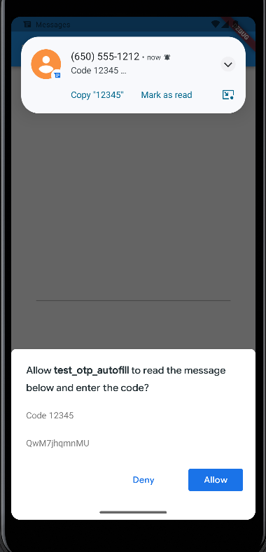
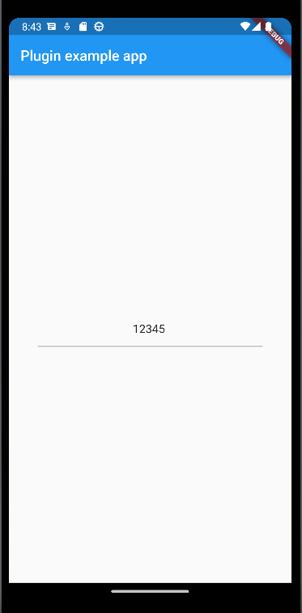

# Testing steps

> These steps is example of testing package`s current stability.

1. Proceed to [example](../example/) directory of current repository.
2. Use [FVM](https://fvm.app/) to install current Flutter version for this package, if your global version differs.
   1. `fvm use`
   2. Setup your IDE to use project`s Flutter version by [this](https://fvm.app/docs/getting_started/configuration/#ide) guide
3. Launch application.
4. Pick example application`s signature from debug console log.
   - 
5. Send SMS message contains 5-symbol code, including all numbers.
   - If you are using Android Emulator, you can use built-in functionality to emulate calls and SMS-messages, by pressing `Extended Controls` and select `Phone` option in side menu.
6. In time SMS message has been received by your device/emulator, you should see alert, asking permission to read SMS message with code and actual message, that will be used to parse code.
    
7. By pressing "Allow" code that was shown on alert, inserts in actual field in example app.
    
    - By pressing deny nothing will be inserted in field and dialog will be closed.